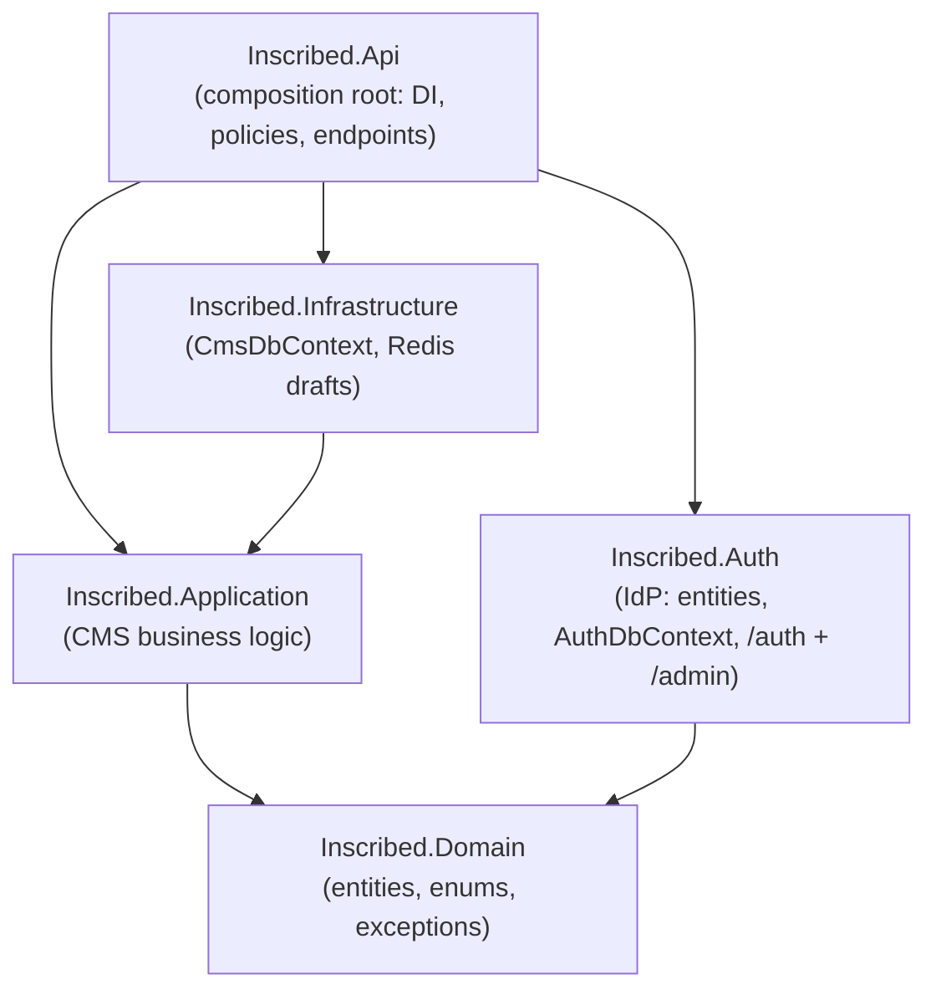
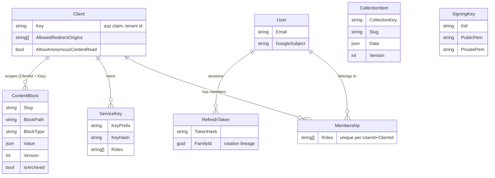

# Inscribed


**Inscribed is a self-hosted, multi-tenant headless CMS backend for teams whose frontend repository is the source of truth for content structure.**

Instead of modelling pages in an admin UI, your deploy pipeline pushes a **manifest** of every editable block on every page to `POST /cms/sync`; the backend reconciles its database against that manifest as a whole (creates, archives, restores), and editors then fill in the values through a panel of your choice. Structured content that is not tied to a page (news, announcements, listings) lives in **collections**, whose schemas are defined in mounted JSON files.

The API ships with its own identity provider: Google sign-in for humans, opaque **service keys** for machines, and self-issued **RS256 JWTs** whose public keys are published as standard JWKS. Everything the CMS knows about identity fits in a four-claim contract, so the auth module can be replaced without touching content code (see [Architecture](#architecture)). Public sites can opt in to fully anonymous, CDN-cacheable reads and skip tokens entirely.

There is deliberately no built-in editor UI: Inscribed is the backend; panels, admin consoles and rendering sites are separate consumers built against the HTTP API.

## Table of contents

- [Features](#features)
- [Requirements](#requirements)
- [Quick start](#quick-start)
- [Core concepts](#core-concepts)
  - [Tenancy: clients](#tenancy-clients)
  - [Pages and content blocks](#pages-and-content-blocks)
  - [Sync: the manifest reconcile](#sync-the-manifest-reconcile)
  - [Drafts](#drafts)
  - [Collections](#collections)
  - [Identity, tokens and roles](#identity-tokens-and-roles)
  - [Anonymous public reads and caching](#anonymous-public-reads-and-caching)
- [Architecture](#architecture)
- [API surface](#api-surface)
- [Configuration reference](#configuration-reference)
- [Error responses](#error-responses)
- [Further reading](#further-reading)
- [Contributing](#contributing)
- [License](#license)

## Features

- **Code-first content structure.** The frontend repo declares which blocks exist; `POST /cms/sync` is an **authoritative whole-state reconcile**, not a patch. Blocks missing from the manifest are archived (never hard-deleted) and restored automatically if they reappear.
- **Self-issued identity provider.** Google OAuth (authorization code + PKCE) for login only; Inscribed mints its own RS256 access tokens with tenant and role claims, publishes JWKS at `/.well-known/jwks.json`, and rotates signing keys at runtime without restarts.
- **Refresh token rotation with reuse detection.** Refresh tokens are opaque, hashed at rest, rotated on every use, and family-revoked on suspected theft, with a configurable leeway window that tolerates network-retry races instead of logging the user out.
- **Machine-to-machine service keys.** `ink_live_…` keys are hashed at rest, compared in constant time, instantly revocable, and carry their own roles; a deploy pipeline syncs content with a key, no login dance.
- **Per-user drafts in Redis.** Editors autosave drafts that overlay published values in their own reads only; publishing clears the draft. Draft data never touches PostgreSQL.
- **Schema-validated collections.** Each collection is a mounted JSON definition file: field schema, slug strategy (user-defined or auto-generated from a field), optional anonymous reads. Definitions are strictly validated at boot; payloads are validated and unknown fields rejected.
- **Optimistic concurrency everywhere.** Every entity carries a `Version`; conflicting writes fail with **409** instead of silently overwriting another editor.
- **CDN-friendly anonymous reads.** Opt-in public endpoints answer with `Cache-Control: public, max-age=60, stale-while-revalidate=300`; editor reads on the same collection routes are marked `private, no-store`.

## Requirements

| Dependency | Version | Notes |
|---|---|---|
| .NET SDK | 9.0 | building and running from source |
| PostgreSQL | 17 (any recent works) | one database, two schemas-by-prefix (`auth_*` tables have their own migration history) |
| Redis | 7 | drafts and OAuth login state; required, not optional |
| Google OAuth client | n/a | the only interactive login method; create one in [Google Cloud Console](https://console.cloud.google.com/apis/credentials) |
| Docker + Compose | optional | the packaged way to run all of the above |

## Quick start

This is the **self-hosted Docker path** ending with content synced and readable through the API. Running from source for development is covered in [CONTRIBUTING.md](CONTRIBUTING.md).

1. Create a Google OAuth client (type: web application). The authorized redirect URI must be exactly `<AUTH_ISSUER>/auth/google/callback`; for a local trial that is `http://localhost:5000/auth/google/callback`.

2. Copy the environment template and fill it in. `BOOTSTRAP_ADMIN_EMAIL` is the Google account that will receive `cms:admin` on first login without needing a membership; `ADMIN_CONSOLE_ORIGIN` is the origin your admin panel (or, for a smoke test, any page you control) runs on.

   ```sh
   cp .env.example .env
   # local trial values:
   #   ASPNETCORE_ENVIRONMENT=Development
   #   AUTH_ISSUER=http://localhost:5000
   #   AUTH_COOKIE_SECURE=false
   ```

   > **Note:** in `Production` the app **refuses to start** with a `localhost` issuer; that guard is why the trial uses `Development`.

3. Start the stack. On boot the API migrates both database schemas, generates an RS256 signing key if none exists, and seeds the `admin` client.

   ```sh
   docker compose up -d --build
   ```

4. Verify the identity provider is alive:

   ```sh
   curl http://localhost:5000/.well-known/jwks.json
   ```

5. Log in as the bootstrap admin by opening this URL in a browser (login is a page redirect, not an XHR):

   ```
   http://localhost:5000/auth/login?clientKey=admin&redirectUri=<ADMIN_CONSOLE_ORIGIN>/auth/done
   ```

   After the Google screen you land back on your origin with an httpOnly refresh cookie set. Exchange it for an access token from that page's devtools console:

   ```js
   const { accessToken } = await fetch("http://localhost:5000/auth/refresh", {
     method: "POST", credentials: "include",
   }).then(r => r.json());
   ```

6. Create a tenant, mint a deploy key, and sync a first page (replace `$TOKEN` with the access token):

   ```sh
   curl -X POST http://localhost:5000/admin/clients \
     -H "Authorization: Bearer $TOKEN" -H "Content-Type: application/json" \
     -d '{"key":"my-site","name":"My Site","allowedRedirectOrigins":["http://localhost:3000"]}'

   curl -X POST http://localhost:5000/admin/clients/my-site/service-keys \
     -H "Authorization: Bearer $TOKEN" -H "Content-Type: application/json" \
     -d '{"name":"deploy","roles":["cms:access"]}'
   # → { "id": "...", "keyPrefix": "ink_live_...", "key": "ink_live_..." }
   #   the raw key is shown ONCE in this response; store it now
   ```

   ```sh
   curl -X POST http://localhost:5000/cms/sync \
     -H "X-Service-Key: ink_live_..." -H "Content-Type: application/json" \
     -d '[{"slug":"home","blocks":[
           {"blockPath":"hero.title","blockType":"Text","defaultValue":"Hello","sortOrder":0},
           {"blockPath":"hero.body","blockType":"RichText","defaultValue":"<p>…</p>","sortOrder":1}
         ]}]'
   ```

7. Read it back:

   ```sh
   curl "http://localhost:5000/cms/content?slug=home" -H "X-Service-Key: ink_live_..."
   ```

You now have a running CMS with one tenant, one synced page, and a working admin identity. Next steps: grant editors access with `POST /admin/clients/{key}/memberships`, wire an editor panel against the API, and read [Core concepts](#core-concepts) for the content model.

## Core concepts

### Tenancy: clients

A **Client** is a tenant: one site or app with its own key, allowed login redirect origins, and page content. The client key travels in the **`azp`** claim of every access token and every service key principal, and page reads/writes are scoped by it. Users are global; a **Membership** binds a user to a client with roles, so the same person can be an editor on one site and nothing on another. Clients are managed through `/admin/clients`; the `admin` client used by the admin console itself is seeded at startup.

> **One limit:** collection items are currently **not** tenant-scoped; a collection's data is shared across all clients of an installation. Page content blocks are fully scoped per client.

### Pages and content blocks

A page is a `slug` plus a flat list of **content blocks**. Each block has a `blockPath` (a stable dotted identifier like `hero.title`), a `blockType`, a JSON `value`, a `sortOrder`, and a `version`. Block types:

| BlockType | Intent |
|---|---|
| `Text`, `ShortText`, `LongText` | plain strings of varying editorial size |
| `RichText` | HTML/rich content |
| `Image`, `Link`, `List`, `Date` | typed values for panel widgets |

Editors publish with `PUT /cms/content`, sending each block's expected `version`; a mismatch fails with **409** so two editors cannot silently overwrite each other. Unchanged values are skipped without a version check.

### Sync: the manifest reconcile

`POST /cms/sync` receives the complete list of pages and blocks that should exist for a client and makes the database match:

- blocks in the manifest but not the DB are **created** with their `defaultValue`;
- blocks in the DB but not the manifest are **archived** (values preserved, hidden from reads);
- archived blocks that reappear are **restored** with their old values intact;
- `blockType` and `sortOrder` are updated in place; published **values are never touched** by sync.

Slugs entirely absent from the manifest are archived and reported back as `prunedSlugs`. Because the reconcile is whole-state, sync is **idempotent**: running the same manifest twice is a no-op.

### Drafts

Drafts are **per user, per page (or per collection item), stored in Redis**, and invisible to everyone but their author. `PUT /cms/draft` saves the overlay; `GET /cms/content` returns each block's published `value` plus a `draftValue` only where the caller's draft actually differs. Publishing via `PUT /cms/content` deletes the caller's draft for that page. Collections have the same mechanism per item, plus a **new-item draft** for content that does not have a slug yet.

> **Note:** drafts are a cache-tier convenience, not durable storage; a Redis flush loses unsaved drafts but never published content.

### Collections

Collections hold structured items that are not blocks on a page. Each collection is a JSON definition file: at startup the API reads every `*.json` file in `Collections:Path` (default `collections/` relative to the working directory, which the compose file mounts to `/app/collections` from `./collections`) and registers each as a collection. The repository ships [collections/news.json](collections/news.json) as a working example:

```json
{
  "key": "projects",
  "allowAnonymousRead": true,
  "slug": { "source": "AutoGenerated", "from": "title" },
  "fields": [
    { "name": "title", "type": "Text", "label": "Title", "required": true },
    { "name": "body", "type": "RichText", "label": "Body" },
    { "name": "tags", "type": "StringArray", "label": "Tags", "filterable": true }
  ]
}
```

A definition declares:

- a **schema** of typed fields (`Text`, `RichText`, `Bool`, `Url`, `StringArray`, `Date`, `Number`, `ObjectArray`, `ShortText`, `LongText`), each optionally `required`, `filterable`, `readOnly`, carrying a `help` text, or nested `itemFields` for `ObjectArray`; `label` defaults to the field name;
- a **slug source**: `UserDefined` (client supplies the slug, `PUT` creates; the default when `slug` is omitted) or `AutoGenerated` (slug derived from a `Text`/`ShortText` field via `slug.from`, `POST` creates, collisions get `-2`, `-3`, … suffixes);
- **`allowAnonymousRead`** for public listings; creating and editing is open to anyone with CMS access.

Adding a collection is a new file plus a restart; there is no hot reload. Definitions are validated strictly at startup, and the app **refuses to boot** on the first broken file: unknown properties (typos), unknown field types, duplicate keys, a `slug.from` that does not reference a `Text`/`ShortText` field, or `itemFields` on a non-`ObjectArray` field all fail with an error naming the file. A misconfigured collection is never silently skipped.

Writes are validated against the schema: wrong types and unknown fields are rejected with **400** (drafts skip only the `Required` check). Listing supports `offset`/`limit` paging (limit clamped to 100) and equality filters on `Filterable` fields via plain query parameters, e.g. `GET /cms/collections/News/?featured=true&tags=release`. `GET /cms/collections/me` tells a panel which collections the current user may create in, with their schemas, so the editor UI is fully schema-driven.

### Identity, tokens and roles

Three credentials exist, each with a distinct job:

| Credential | Form | Lifetime | Revocable | Carried in |
|---|---|---|---|---|
| Access token | RS256 JWT | 15 min (config) | no (by design) | `Authorization: Bearer` |
| Refresh token | opaque, hashed in DB | 30 days (config) | yes, instantly | httpOnly cookie, `Path=/auth` |
| Service key | opaque `ink_live_…`, hashed in DB | optional expiry | yes, instantly | `X-Service-Key` or `Authorization: Bearer` |

Humans sign in with Google (`/auth/login` → callback → refresh cookie); Inscribed then issues its own tokens, so roles and tenancy live in **your** database, not Google's. Machines use service keys; a policy scheme routes each request to the right authentication handler, so every endpoint accepts both without knowing the difference.

Roles are computed at refresh time from memberships (plus the bootstrap-admin allowlist), so a role change takes effect within one access-token lifetime:

| Role | Grants |
|---|---|
| `cms:access` | editor: read and write CMS content |
| `cms:read` | read-only; meant for render service keys of private sites |
| `cms:admin` | `/admin/*`: clients, memberships, service keys, signing-key rotation |

The full design rationale (rotation, reuse leeway, key rotation grace, cookie strategy) is documented in [docs/auth.md](docs/auth.md).

### Anonymous public reads and caching

For public sites there is a third read path that needs **no credential at all**: if an admin flips a client's `AllowAnonymousContentRead` flag, `GET /cms/public/{clientKey}/data?slug=…` serves published block values with CDN-cacheable headers. If the flag is off or the client key is unknown the endpoint returns **404**, leaking neither existence nor policy. Collection reads can likewise be opened per collection via `AllowAnonymousRead`. Anonymous responses are cached (`public, max-age=60, stale-while-revalidate=300`). Collection read routes set `Vary: Authorization` and answer `private, no-store` to signed-in editors; the page endpoints (`/cms/content`, `/cms/data`) send no cache headers, so nothing caches them.

## Architecture

Five projects, one dependency rule: **content code never depends on auth**. The only thing the CMS knows about identity is a four-claim contract.



- **Claim contract.** Everything the CMS reads from an authenticated request: `sub` (user or `service:{id}`), `azp` (tenant client key), `roles`, plus `name` and `email` for display. Any token issuer that honours these claims can replace `Inscribed.Auth` without a single change to `Application`.
- **Authorization policies live in `Program.cs`**, not in the auth module: "who may edit content" is a CMS concern and must survive swapping the identity provider.
- **Two DbContexts, one database.** `CmsDbContext` owns content tables; `AuthDbContext` owns `auth_*` tables with its own migration history (`__ef_migrations_history_auth`), so removing the auth module removes its schema cleanly.
- **Secrets are hashes.** Refresh tokens and service keys are stored as SHA-256 only; raw values exist exactly once, in the response that created them.

Data model at a glance:



Extension points, in the order you are likely to need them:

| Seam | Contract | Default | What it abstracts |
|---|---|---|---|
| Collection definition | `ICollectionPolicy` ([src](src/Inscribed.Application/Contracts/Policies/ICollectionPolicy.cs)) | `FileCollectionPolicy` loaded from mounted JSON files | schema, slug strategy, permissions, enrichment per collection |
| Draft storage | `IDraftService`, `ICollectionDraftService` | Redis implementations | where autosaved drafts live |
| Content persistence | `IContentBlockRepository`, `ICollectionItemRepository` | EF Core + PostgreSQL | storage engine for published content |
| Identity | the claim contract (`sub`/`azp`/`roles`/`name`/`email`) | `Inscribed.Auth` | who issues and validates tokens |

## API surface

All routes return JSON; errors are RFC 7807 problem details (see [Error responses](#error-responses)). Policy column: **CmsRead** accepts `cms:read` or `cms:access`; **CmsAccess** requires `cms:access`; **Admin** requires `cms:admin`; **anon\*** means anonymous when the relevant opt-in flag/policy allows it, otherwise CmsRead.

**Content**

| Method & path | Policy | Purpose |
|---|---|---|
| `GET /cms/content?slug=` | CmsRead | published blocks + caller's draft overlay |
| `GET /cms/data?slug=` | CmsRead | published values only, no draft overlay |
| `GET /cms/public/{clientKey}/data?slug=` | anon\* | as above, credential-free, CDN-cacheable |
| `PUT /cms/content` | CmsAccess | publish block values (optimistic concurrency) |
| `PUT /cms/draft` | CmsAccess | save the caller's page draft |
| `POST /cms/sync` | CmsAccess | whole-state manifest reconcile |

**Collections**

| Method & path | Policy | Purpose |
|---|---|---|
| `GET /cms/collections/me` | CmsAccess | collections the caller may create in, with schemas |
| `GET /cms/collections/{key}/schema` | anon\* | field schema of a collection |
| `GET /cms/collections/{key}/?offset=&limit=&field=` | anon\* | paged, filterable listing |
| `GET /cms/collections/{key}/{slug}` | anon\* | single item (+ caller's draft when signed in) |
| `POST /cms/collections/{key}/` | CmsAccess | create item (auto-generated slug collections) |
| `PUT /cms/collections/{key}/{slug}` | CmsAccess | upsert item (user-defined slug collections) / update |
| `PUT /cms/collections/{key}/{slug}/draft` | CmsAccess | save item draft |
| `POST /cms/collections/{key}/drafts` | CmsAccess | save draft for a not-yet-created item |

**Auth**

| Method & path | Policy | Purpose |
|---|---|---|
| `GET /.well-known/jwks.json` | public | RS256 public keys (JWKS) |
| `GET /auth/login?clientKey=&redirectUri=` | public | start Google login (302) |
| `GET /auth/google/callback` | public | complete login, set refresh cookie, 302 to SPA |
| `POST /auth/refresh` | cookie | rotate refresh token, return `{ accessToken, expiresAtUtc }` |
| `POST /auth/logout` | cookie | revoke refresh token, delete cookie |

**Admin**

| Method & path | Purpose |
|---|---|
| `GET /admin/users` | list users (created on first login) |
| `GET`/`POST /admin/clients`, `PUT /admin/clients/{key}` | tenant CRUD incl. `allowAnonymousContentRead`, `isActive` |
| `POST /admin/clients/{key}/memberships` | upsert a user's roles on a client |
| `DELETE /admin/clients/{key}/memberships/{email}` | remove membership |
| `GET`/`POST /admin/clients/{key}/service-keys` | list (prefix + metadata only) / create (raw key shown once) |
| `DELETE /admin/clients/{key}/service-keys/{id}` | revoke a service key |
| `POST /admin/signing-keys/rotate` | rotate the RS256 signing key (old key verifies for a 1 h grace) |

## Configuration reference

Configuration binds from the `Auth` section (typed, validated at startup) plus standard ASP.NET sections. Every key can be supplied as an environment variable with `__` as the separator (`Auth__Google__ClientSecret=…`); [docker-compose.yml](docker-compose.yml) maps the important ones from `.env`.

| Key | Default | Meaning |
|---|---|---|
| `ConnectionStrings:Default` | (required) | PostgreSQL connection string |
| `ConnectionStrings:Redis` | `localhost:6379` | Redis for drafts and login state |
| `Cors:AllowedOrigins` | `http://localhost:3001` | comma-separated SPA origins; credentialed CORS is enabled for the refresh cookie |
| `Auth:Issuer` | `http://localhost:5000` | `iss` claim and public base URL; the Google redirect URI derives from it. **Must not be localhost in Production** (startup fails) |
| `Auth:Audience` | `inscribed-cms` | `aud` claim |
| `Auth:AccessTokenMinutes` | `15` | access token lifetime |
| `Auth:RefreshTokenDays` | `30` | refresh token lifetime |
| `Auth:ReuseLeewaySeconds` | `30` | rotation race tolerance; `0` = strict reuse detection |
| `Auth:AdminClientKey` | `admin` | key of the admin-console client seeded at startup |
| `Auth:Cookie:{Name,SameSite,Secure}` | `inscribed_rt`, `Lax`, `true` | refresh cookie attributes; local HTTP dev needs `Secure=false` |
| `Auth:Google:{ClientId,ClientSecret,CallbackPath}` | empty, empty, `/auth/google/callback` | Google OAuth client |
| `Auth:Admin:Role` | `cms:admin` | role name required by `/admin/*` |
| `Auth:Admin:BootstrapAdmins` | `[]` | e-mails that receive the admin role without a membership |
| `Auth:Admin:ConsoleOrigins` | `[]` | allowed login redirect origins of the seeded admin client |

## Error responses

Failures return RFC 7807 `application/problem+json` bodies mapped by a global handler:

| Status | When |
|---|---|
| `400` | schema/validation failures, malformed requests, unknown filter fields |
| `401` | missing/invalid credential, refresh token invalid or family-revoked |
| `403` | authenticated but not permitted (policy or collection `CanEdit`/`CanCreate` refusal) |
| `404` | unknown slug/item/client, and public reads with the anonymous flag off (deliberate non-disclosure) |
| `409` | optimistic concurrency conflict; re-read and retry with the fresh `version` |

## Further reading

- [docs/auth.md](docs/auth.md): the auth system end to end, every security decision with its rationale, plus the smoke-test chain used to verify auth changes.

## Contributing

See [CONTRIBUTING.md](CONTRIBUTING.md) for the development setup, project philosophy, migration workflow, and commit conventions.

## License

Inscribed is licensed under the [GNU Lesser General Public License v3.0](LICENSE). The LGPL is a set of additional permissions on top of the [GNU General Public License v3.0](COPYING); both files ship with the repository.