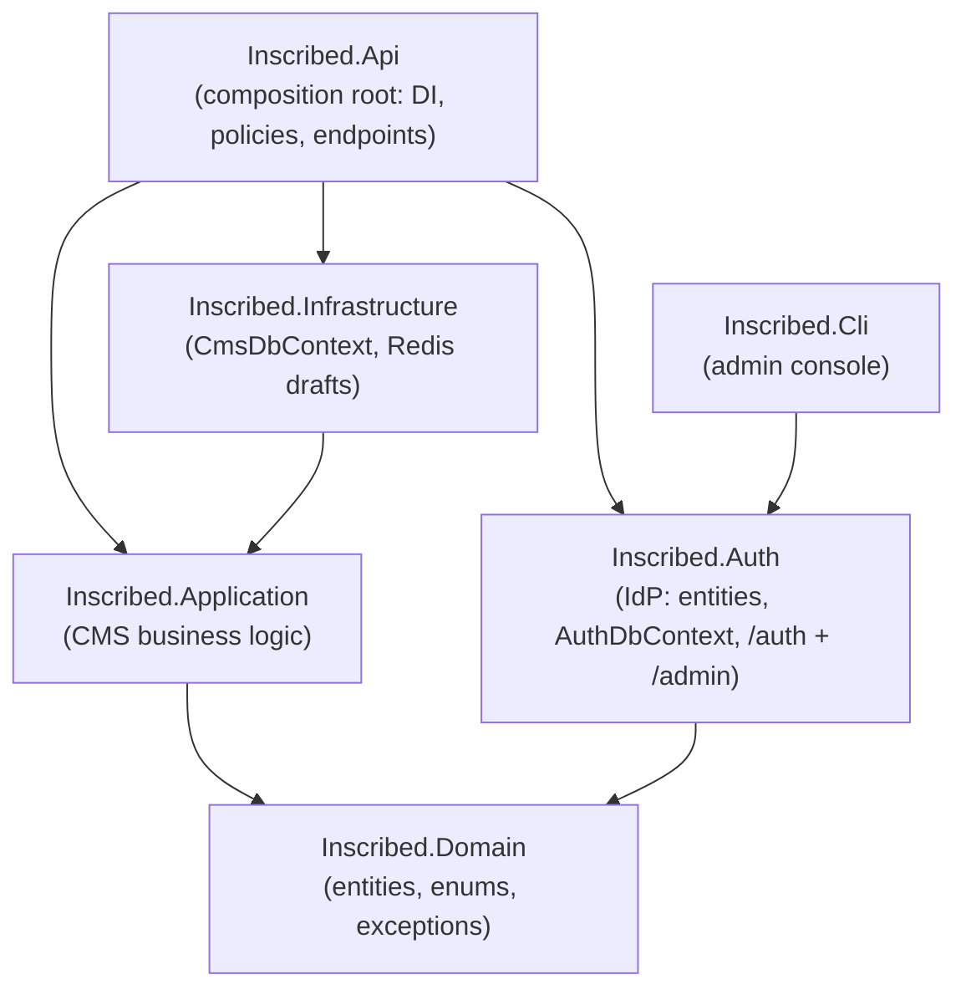
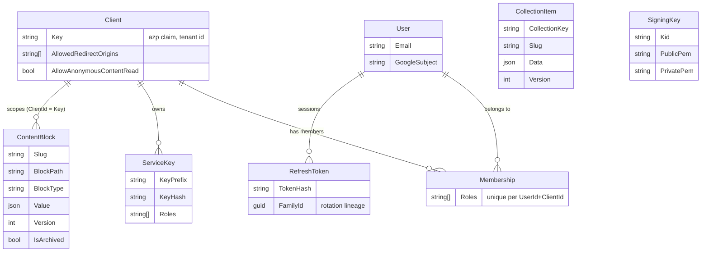

# Inscribed


**Inscribed is a self-hosted, multi-tenant headless CMS backend for teams whose frontend repository is the source of truth for content structure.**

Instead of modelling pages in an admin UI, your deploy pipeline pushes a **manifest** of every editable block on every page to `POST /cms/sync`; the backend reconciles its database against that manifest as a whole (creates, archives, restores), and editors then fill in the values through a panel of your choice. Structured content that is not tied to a page (news, announcements, listings) lives in **collections**, whose schemas are defined in mounted JSON files.

The API ships with its own identity provider: Google sign-in for humans, opaque **service keys** for machines, and self-issued **RS256 JWTs** whose public keys are published as standard JWKS. Everything the CMS knows about identity fits in a four-claim contract, so the auth module can be replaced without touching content code (see [Architecture](#architecture)). Public sites can opt in to fully anonymous, CDN-cacheable reads and skip tokens entirely.

There is deliberately no built-in editor UI: Inscribed is the backend; panels, admin consoles and rendering sites are separate consumers built against the HTTP API.

## Table of contents

- [Features](#features)
- [Requirements](#requirements)
- [Quick start](#quick-start)
- [Core concepts](#core-concepts)
  - [Tenancy: clients](#tenancy-clients)
  - [Pages and content blocks](#pages-and-content-blocks)
  - [Sync: the manifest reconcile](#sync-the-manifest-reconcile)
  - [Drafts](#drafts)
  - [Collections](#collections)
  - [Identity, tokens and capabilities](#identity-tokens-and-capabilities)
  - [Anonymous public reads and caching](#anonymous-public-reads-and-caching)
- [Architecture](#architecture)
- [API surface](#api-surface)
- [Admin CLI](#admin-cli)
- [Configuration reference](#configuration-reference)
- [Error responses](#error-responses)
- [Further reading](#further-reading)
- [Contributing](#contributing)
- [License](#license)

## Features

- **Code-first content structure.** The frontend repo declares which blocks exist; `POST /cms/sync` is an **authoritative whole-state reconcile**, not a patch. Blocks missing from the manifest are archived (never hard-deleted) and restored automatically if they reappear.
- **Self-issued identity provider.** Google OAuth (authorization code + PKCE) for login only; Inscribed mints its own RS256 access tokens with tenant and capability claims, publishes JWKS at `/.well-known/jwks.json`, and rotates signing keys at runtime without restarts.
- **Refresh token rotation with reuse detection.** Refresh tokens are opaque, hashed at rest, rotated on every use, and family-revoked on suspected theft, with a configurable leeway window that tolerates network-retry races instead of logging the user out.
- **Machine-to-machine service keys.** `ink_live_…` keys are hashed at rest, compared in constant time, instantly revocable, and carry their own capabilities; a deploy pipeline syncs content with a key, no login dance.
- **Per-user drafts in Redis.** Editors autosave drafts that overlay published values in their own reads only; publishing clears the draft. Draft data never touches PostgreSQL.
- **Schema-validated collections.** Each collection is a mounted JSON definition file: field schema, slug strategy (user-defined or auto-generated from a field), optional anonymous reads. Definitions are strictly validated: the app refuses to boot on a broken file rather than skip it. Payloads are validated and unknown fields rejected.
- **Declarative external data.** A collection file can enrich items from external APIs at read time (URL template + response field map), with response caching and timeouts by default; an upstream outage never fails a read. Credentials are named config entries (API key or OAuth2 client credentials with self-managed tokens); secrets never appear in definition files or logs.
- **Optimistic concurrency everywhere.** Every entity carries a `Version`, checked both against the version the caller sent and, at the database, against the row as it was read; either kind of clash fails with **409** instead of silently overwriting another editor.
- **CDN-friendly anonymous reads.** Opt-in public endpoints answer with `Cache-Control: public, max-age=60, stale-while-revalidate=300`; editor reads on the same collection routes are marked `private, no-store`.

## Requirements

| Dependency | Version | Notes |
|---|---|---|
| .NET SDK | 9.0 | building and running from source |
| PostgreSQL | 17 (any recent works) | one database, two schemas-by-prefix (`auth_*` tables have their own migration history) |
| Redis | 7 | drafts and OAuth login state; required, not optional |
| Google OAuth client | n/a | the only interactive login method; create one in [Google Cloud Console](https://console.cloud.google.com/apis/credentials) |
| Docker + Compose | optional | the packaged way to run all of the above |

## Quick start

This is the **self-hosted Docker path** ending with content synced and readable through the API. Running from source for development is covered in [CONTRIBUTING.md](CONTRIBUTING.md).

1. Create a Google OAuth client (type: web application). The authorized redirect URI must be exactly `<AUTH_ISSUER>/auth/google/callback`; for a local trial that is `http://localhost:5000/auth/google/callback`.

2. Copy the environment template and fill it in. `BOOTSTRAP_ADMIN_EMAIL` is the Google account that will receive `tenant:admin` on first login without needing a membership; `ADMIN_CONSOLE_ORIGIN` is the origin your admin panel (or, for a smoke test, any page you control) runs on.

   ```sh
   cp .env.example .env
   # local trial values:
   #   ASPNETCORE_ENVIRONMENT=Development
   #   AUTH_ISSUER=http://localhost:5000
   #   AUTH_COOKIE_SECURE=false
   ```

   > **Note:** in `Production` the app **refuses to start** with a `localhost` issuer; that guard is why the trial uses `Development`.

3. Start the stack. On boot the API migrates both database schemas, generates an RS256 signing key if none exists, and seeds the `admin` client.

   ```sh
   docker compose up -d --build
   ```

4. Verify the identity provider is alive:

   ```sh
   curl http://localhost:5000/.well-known/jwks.json
   ```

5. Log in as the bootstrap admin by opening this URL in a browser (login is a page redirect, not an XHR):

   ```
   http://localhost:5000/auth/login?clientKey=admin&redirectUri=<ADMIN_CONSOLE_ORIGIN>/auth/done
   ```

   After the Google screen you land back on your origin with an httpOnly refresh cookie set. Exchange it for an access token from that page's devtools console:

   ```js
   const { accessToken } = await fetch("http://localhost:5000/auth/refresh", {
     method: "POST", credentials: "include",
   }).then(r => r.json());
   ```

6. Create a tenant, mint a deploy key, and sync a first page (replace `$TOKEN` with the access token):

   > **Tip:** steps 5 and 6 exist because `/admin/*` needs an admin token. With the .NET SDK installed you can skip the browser and the devtools console entirely: the [admin CLI](#admin-cli) performs the same operations straight against the database, with no token at all.

   ```sh
   curl -X POST http://localhost:5000/admin/clients \
     -H "Authorization: Bearer $TOKEN" -H "Content-Type: application/json" \
     -d '{"key":"my-site","name":"My Site","allowedRedirectOrigins":["http://localhost:3000"]}'

   curl -X POST http://localhost:5000/admin/clients/my-site/service-keys \
     -H "Authorization: Bearer $TOKEN" -H "Content-Type: application/json" \
     -d '{"name":"deploy","capabilities":["deploy","render"]}'
   # → { "id": "...", "keyPrefix": "ink_live_...", "key": "ink_live_..." }
   #   the raw key is shown ONCE in this response; store it now
   ```

   > **Note:** presets compose, so this one key can both sync and read back, which keeps the trial to a single credential. In production give the pipeline `deploy` and the rendering site `render` as **separate** keys: a leaked render key then cannot reconcile your schema away.

   ```sh
   curl -X POST http://localhost:5000/cms/sync \
     -H "Authorization: Bearer ink_live_..." -H "Content-Type: application/json" \
     -d '[{"slug":"home","blocks":[
           {"blockPath":"hero.title","blockType":"Text","defaultValue":"Hello","sortOrder":0},
           {"blockPath":"hero.body","blockType":"RichText","defaultValue":"<p>…</p>","sortOrder":1}
         ]}]'
   ```

7. Read it back:

   ```sh
   curl "http://localhost:5000/cms/content?slug=home" -H "Authorization: Bearer ink_live_..."
   ```

You now have a running CMS with one tenant, one synced page, and a working admin identity. Next steps: grant editors access with `POST /admin/clients/{key}/memberships`, wire an editor panel against the API, and read [Core concepts](#core-concepts) for the content model.

## Core concepts

### Tenancy: clients

A **Client** is a tenant: one site or app with its own key, allowed login redirect origins, and page content. The client key travels in the **`azp`** claim of every access token and every service key principal, and page reads/writes are scoped by it. Users are global; a **Membership** binds a user to a client with capabilities, so the same person can be an editor on one site and nothing on another. Clients are managed through `/admin/clients`; the `admin` client used by the admin console itself is seeded at startup.

> **One limit:** collection items are currently **not** tenant-scoped; a collection's data is shared across all clients of an installation. Page content blocks are fully scoped per client.

### Pages and content blocks

A page is a `slug` plus a flat list of **content blocks**. Each block has a `blockPath` (a stable dotted identifier like `hero.title`), a `blockType`, a JSON `value`, a `sortOrder`, and a `version`. Block types:

| BlockType | Intent |
|---|---|
| `Text`, `ShortText`, `LongText` | plain strings of varying editorial size |
| `RichText` | HTML/rich content |
| `Image`, `Link`, `List`, `Date` | typed values for panel widgets |

Editors publish with `PUT /cms/content`, sending each block's expected `version`; a mismatch fails with **409** listing every clashing block, so two editors cannot silently overwrite each other. Unchanged values are skipped without a version check, which is also the one case where `version` may be omitted: a block whose value actually changed must carry one, or the request fails with **400**. Nothing is written unless every block passes, so a rejected publish is a no-op rather than a partial one.

### Sync: the manifest reconcile

`POST /cms/sync` receives the complete list of pages and blocks that should exist for a client and makes the database match:

- blocks in the manifest but not the DB are **created** with their `defaultValue`;
- blocks in the DB but not the manifest are **archived** (values preserved, hidden from reads);
- archived blocks that reappear are **restored** with their old values intact;
- `blockType` and `sortOrder` are updated in place; published **values are never touched** by sync.

Slugs entirely absent from the manifest are archived and reported back as `prunedSlugs`. Because the reconcile is whole-state, sync is **idempotent**: running the same manifest twice is a no-op.

### Locales

Locale is **optional everywhere**. A client that sends no `locale` behaves exactly as it did before the feature existed, and the migration that introduced it touches no rows.

The manifest stays locale-free: a localized app still declares one `/about` page, not one per language. Instead the frontend declares its languages on the sync call itself, and the backend fans out:

```sh
curl -X POST "http://localhost:5000/cms/sync?locales=tr,en" \
  -H "Authorization: Bearer ink_live_..." \
  -d '[{ "slug": "/about", "blocks": [ ... ] }]'
```

Sync is the single authority for the list; the admin console and CLI show it read-only. That is deliberate: two writers would let the manifest and the database drift apart silently. `?locales=` omitted leaves the current list alone, and `?locales=` empty clears it.

Each sync then reconciles **one row per block per locale**:

- rows that predate localization are **adopted** into the first locale, keeping their values and versions, so existing content lands in the default language without a backfill or a guess about what language it was in;
- the remaining locales materialize at `defaultValue`;
- adding a language later is just re-running sync with a longer list.

There is **no fallback chain**. An untranslated block renders its `defaultValue`, because sync already put a real row there. A missing translation is meant to be visible rather than quietly wearing another language's text, and it keeps reads a single indexed lookup with no coalesce.

Reads and writes disagree about an unknown `?locale=` on purpose:

| | Unknown `?locale=` |
|---|---|
| Reads (`GET`) | fall back to the default locale, and report what was actually served in the response's `locale` field |
| Writes (`PUT`, `POST`, `DELETE`) | **400** |

A read endpoint is anonymous and CDN-cacheable, so a 400 there breaks the page for visitors over a typo; echoing the resolved locale back keeps the fallback from being silent. A write that fell back would put content in the wrong language or delete the wrong language's draft, which is worth an error.

`version` lives on the row and is therefore per locale: editing the English copy never bumps the Turkish one, so two translators do not hand each other spurious 409s. Drafts are laned the same way, so both languages of one page can have autosaves in flight at once.

Reads are lenient, writes are not: a write carrying a locale nobody declared is a **400** even when the collection or client declares none at all, which is what surfaces "the app is configured for two languages but the backend was never told".

Collections are global rather than tenant-scoped, so they declare their own `locales` in their definition file instead of taking the client's. A collection record and its translation get **different slugs** (`yeni-urun` / `new-product`) because that is what is correct for SEO, so they are linked by a `translationGroupId` rather than by slug; a single-item read returns its siblings for a language switcher. See [docs/collections.md](docs/collections.md#locales).

### Drafts

Drafts are **per user, per page (or per collection item), stored in Redis**, and invisible to everyone but their author. `PUT /cms/draft` merges the blocks it receives into the caller's existing overlay for that slug, so an editor can autosave one block at a time without dropping the others; `GET /cms/content` returns each block's published `value` plus a `draftValue` only where the caller's draft actually differs. Sending a block its published value therefore reverts it. `DELETE /cms/draft?slug=…` discards the whole page draft in one call, which is the honest way to abandon changes: echoing published values back would resurrect them as a real draft if someone else published in the meantime, since draft writes carry no version check. Publishing via `PUT /cms/content` deletes the caller's draft for that page too. Collections have the same mechanism per item, except an item draft is one whole-object form and is replaced, not merged, plus a **new-item draft** for content that does not have a slug yet.

> **Note:** drafts are a cache-tier convenience, not durable storage; a Redis flush loses unsaved drafts but never published content.

### Collections

Collections hold structured items that are not blocks on a page. Each collection is a **JSON definition file**: at startup the API reads every `*.json` file in `Collections:Path` (default `collections/`, mounted from `./collections` in the compose file) and registers it. Adding a collection is a new file plus a restart; **no code, no migration**. The repository ships [collections/news.json](collections/news.json) as a working example:

```json
{
  "key": "projects",
  "allowAnonymousRead": true,
  "slug": { "source": "AutoGenerated", "from": "title" },
  "fields": [
    { "name": "title", "type": "ShortText", "label": "Title", "required": true },
    { "name": "repo",  "type": "ShortText", "help": "owner/name" },
    { "name": "tags",  "type": "StringArray", "filterable": true }
  ],
  "enrich": [
    {
      "url": "https://api.github.com/repos/{repo}",
      "auth": "github",
      "map": { "stars": "stargazers_count", "ownerAvatar": "owner.avatar_url" }
    }
  ]
}
```

A definition declares a **schema** of typed fields, a **slug strategy** (user-defined or auto-generated from a field), an **anonymous-read** opt-in, and optional **read-time enrichment**: declarative `enrich` entries that fill item responses from external APIs, with caching, a 3-second timeout, and a hard guarantee that an upstream failure returns the item unenriched instead of failing the read. Credentials for enrichment (API keys, OAuth2 client credentials with self-managed tokens) are referenced **by name** and live in configuration, never in the definition file.

Definitions are validated strictly at startup and a broken file **aborts boot** with an error naming the file and every violation; a misconfigured collection is never silently skipped. The full definition reference, enrichment semantics, credential types, token lifecycle, and trust model live in [docs/collections.md](docs/collections.md).

Writes are validated against the schema: wrong types and unknown fields are rejected with **400** (drafts skip only the `Required` check). Updating an existing item requires `version`, like a page publish does; omitting it fails with **400** rather than overwriting whoever wrote last. Creation carries no version, since there is nothing to conflict with. Listing supports `offset`/`limit` paging (limit clamped to 100) and equality filters on `Filterable` fields via plain query parameters, e.g. `GET /cms/collections/News/?featured=true&tags=release`. `GET /cms/collections/me` tells a panel which collections the current user may create in, with their schemas, so the editor UI is fully schema-driven.

### Identity, tokens and capabilities

Three credentials exist, each with a distinct job:

| Credential | Form | Lifetime | Revocable | Carried in |
|---|---|---|---|---|
| Access token | RS256 JWT | 15 min (config) | no (by design) | `Authorization: Bearer` |
| Refresh token | opaque, hashed in DB | 30 days (config) | yes, instantly | httpOnly cookie, `Path=/auth` |
| Service key | opaque `ink_live_…`, hashed in DB | optional expiry | yes, instantly | `Authorization: Bearer` |

Humans sign in with Google (`/auth/login` → callback → refresh cookie); Inscribed then issues its own tokens, so capabilities and tenancy live in **your** database, not Google's. Machines use service keys; a policy scheme routes each request to the right authentication handler, so every endpoint accepts both without knowing the difference.

Authorization is a **set of capabilities**, not a rank. A principal holds any combination, and both credential kinds draw from the same vocabulary. Capabilities are computed at refresh time from memberships (plus the bootstrap-admin allowlist), so a grant change takes effect within one access-token lifetime:

| Capability | Grants | Typical holder |
|---|---|---|
| `content:read` | read published pages and collections | render service key, SSR frontend |
| `content:write` | page content and drafts, collection items and drafts | editors |
| `schema:sync` | `POST /cms/sync` only | deploy pipeline |
| `tenant:admin` | `/admin/*`: clients, memberships, service keys, signing-key rotation | operators |

Splitting `schema:sync` from `content:write` is the point of the model: reconciling the block manifest is a deploy-time machine job, editing values is a human one, and a render process needs neither. A render key that also carried write capability could prune your content if the SSR host were compromised.

`tenant:admin` is for humans only: `/admin/*` can mint service keys, so a machine holding it could issue itself replacements and outlive revocation. Service-key principals are rejected there even if their stored capability list says otherwise, and the bootstrap-admin allowlist only applies to logins through the admin client.

The full design rationale (rotation, reuse leeway, key rotation grace, cookie strategy) is documented in [docs/auth.md](docs/auth.md).

### Anonymous public reads and caching

For public sites there is a third read path that needs **no credential at all**: if an admin flips a client's `AllowAnonymousContentRead` flag, `GET /cms/public/{clientKey}/content?slug=…` serves published block values with CDN-cacheable headers. If the flag is off or the client key is unknown the endpoint returns **404**, leaking neither existence nor policy. Collection reads can likewise be opened per collection via `AllowAnonymousRead`.

On collection read routes the two halves of `Cache-Control` answer different questions. **Shared or private** is a property of the *content*: a collection with `AllowAnonymousRead` may sit in a CDN, one without it may not, no matter who asked. **Fresh or stored** is a property of the *caller*: only a holder of `content:write` sees draft overlays, so only they get `no-store`.

| Caller | Public collection | Private collection |
|---|---|---|
| anonymous | `public, max-age=60, stale-while-revalidate=300` | 401 |
| `content:read` | `public, max-age=60, stale-while-revalidate=300` | `private, max-age=60` |
| `content:write` | `private, no-store` | `private, no-store` |

All of them send `Vary: Authorization`. Both credential kinds travel in that one header, so it is a complete cache key: a shared cache can never hand a private collection to a caller who presented no credential. A `content:read` principal also skips the per-item draft lookup entirely, so a render key costs zero Redis round-trips per item. `GET /cms/content` follows the same rule, reading the tenant-wide `AllowAnonymousContentRead` flag where a collection reads its own.

## Architecture

Six projects, one dependency rule: **content code never depends on auth**. The only thing the CMS knows about identity is a four-claim contract.


```mermaid
flowchart TD
    Api["Inscribed.Api<br/>(composition root: DI, policies, endpoints)"]
    Cli["Inscribed.Cli<br/>(admin console)"]
    App["Inscribed.Application<br/>(CMS business logic)"]
    Infra["Inscribed.Infrastructure<br/>(CmsDbContext, Redis drafts)"]
    Auth["Inscribed.Auth<br/>(IdP: entities, AuthDbContext, /auth + /admin)"]
    Domain["Inscribed.Domain<br/>(entities, enums, exceptions)"]

    Api --> App
    Api --> Infra
    Api --> Auth
    Cli --> Auth
    App --> Domain
    Infra --> App
    Auth --> Domain
```

- **Claim contract.** Everything the CMS reads from an authenticated request: `sub` (user or `service:{id}`), `azp` (tenant client key), `roles`, plus `name` and `email` for display. Any token issuer that honours these claims can replace `Inscribed.Auth` without a single change to `Application`.
- **Authorization policies live in `Program.cs`**, not in the auth module: "who may edit content" is a CMS concern and must survive swapping the identity provider.
- **Two DbContexts, one database.** `CmsDbContext` owns content tables; `AuthDbContext` owns `auth_*` tables with its own migration history (`__ef_migrations_history_auth`), so removing the auth module removes its schema cleanly.
- **Secrets are hashes.** Refresh tokens and service keys are stored as SHA-256 only; raw values exist exactly once, in the response that created them.

Data model at a glance:


```mermaid
erDiagram
    Client ||--o{ Membership : "has members"
    User ||--o{ Membership : "belongs to"
    Client ||--o{ ServiceKey : "owns"
    User ||--o{ RefreshToken : "sessions"
    Client ||--o{ ContentBlock : "scopes (ClientId = Key)"

    Client {
        string Key "azp claim, tenant id"
        string[] AllowedRedirectOrigins
        bool AllowAnonymousContentRead
    }
    User {
        string Email
        string GoogleSubject
    }
    Membership {
        string[] Roles "unique per UserId+ClientId"
    }
    RefreshToken {
        string TokenHash
        guid FamilyId "rotation lineage"
    }
    ServiceKey {
        string KeyPrefix
        string KeyHash
        string[] Roles
    }
    ContentBlock {
        string Slug
        string BlockPath
        string BlockType
        json Value
        int Version
        bool IsArchived
    }
    CollectionItem {
        string CollectionKey
        string Slug
        json Data
        int Version
    }
    SigningKey {
        string Kid
        string PublicPem
        string PrivatePem
    }
```

Extension points, in the order you are likely to need them:

| Seam | Contract | Default | What it abstracts |
|---|---|---|---|
| Collection definition | `ICollectionPolicy` ([src](src/Inscribed.Application/Contracts/Policies/ICollectionPolicy.cs)) | `FileCollectionPolicy` loaded from mounted JSON files | schema, slug strategy, permissions, enrichment per collection |
| Collection enrichment | `ICollectionEnricher`, `ICollectionEnricherFactory` ([src](src/Inscribed.Application/Contracts/Policies/ICollectionEnricher.cs)) | `HttpEnricher` (declarative URL + map) | read-time augmentation from external APIs |
| Draft storage | `IDraftService`, `ICollectionDraftService` | Redis implementations | where autosaved drafts live |
| Content persistence | `IContentBlockRepository`, `ICollectionItemRepository` | EF Core + PostgreSQL | storage engine for published content |
| Identity | the claim contract (`sub`/`azp`/`roles`/`name`/`email`) | `Inscribed.Auth` | who issues and validates tokens |

## API surface

All routes return JSON; errors are RFC 7807 problem details (see [Error responses](#error-responses)). Policy column: **ContentRead** accepts `cms:read` or `cms:access`; **ContentWrite** and **SchemaSync** require `cms:access`; **TenantAdmin** requires `cms:admin` and a human principal; **anon\*** means anonymous when the relevant opt-in flag/policy allows it, otherwise ContentRead.

**Content**

| Method & path | Policy | Purpose |
|---|---|---|
| `GET /cms/content?slug=&locale=` | ContentRead | published blocks; the caller's draft overlay is added only for `content:write` |
| `GET /cms/public/{clientKey}/content?slug=&locale=` | anon\* | as above, credential-free, CDN-cacheable |
| `PUT /cms/content?locale=` | ContentWrite | publish block values (optimistic concurrency) |
| `PUT /cms/draft?locale=` | ContentWrite | merge blocks into the caller's page draft |
| `DELETE /cms/draft?slug=&locale=` | ContentWrite | discard the caller's whole page draft |
| `POST /cms/sync?locales=` | SchemaSync | whole-state manifest reconcile; also declares the client's locales |

**Collections**

| Method & path | Policy | Purpose |
|---|---|---|
| `GET /cms/collections/me` | ContentWrite | collections the caller may create in, with schemas |
| `GET /cms/collections/{key}/schema` | anon\* | field schema of a collection |
| `GET /cms/collections/{key}/?offset=&limit=&locale=&field=` | anon\* | paged, filterable listing |
| `GET /cms/collections/{key}/{slug}` | anon\* | single item (+ caller's draft when signed in) |
| `POST /cms/collections/{key}/?locale=&translationGroup=` | ContentWrite | create item (auto-generated slug collections) |
| `PUT /cms/collections/{key}/{slug}?locale=&translationGroup=` | ContentWrite | upsert item (user-defined slug collections) / update |
| `PUT /cms/collections/{key}/{slug}/draft` | ContentWrite | save item draft |
| `DELETE /cms/collections/{key}/{slug}/draft` | ContentWrite | discard item draft |
| `POST /cms/collections/{key}/drafts?locale=&translationGroup=` | ContentWrite | save draft for a not-yet-created item |
| `DELETE /cms/collections/{key}/drafts?locale=` | ContentWrite | discard the not-yet-created item draft |

**Auth**

| Method & path | Policy | Purpose |
|---|---|---|
| `GET /.well-known/jwks.json` | public | RS256 public keys (JWKS) |
| `GET /auth/login?clientKey=&redirectUri=` | public | start Google login (302) |
| `GET /auth/google/callback` | public | complete login, set refresh cookie, 302 to SPA |
| `POST /auth/refresh` | cookie | rotate refresh token, return `{ accessToken, expiresAtUtc }` |
| `POST /auth/logout` | cookie | revoke refresh token, delete cookie |

**Admin**

| Method & path | Purpose |
|---|---|
| `GET /admin/users` | list users (created on first login) |
| `GET`/`POST /admin/clients`, `PUT /admin/clients/{key}` | tenant CRUD incl. `allowAnonymousContentRead`, `isActive` |
| `GET`/`POST /admin/clients/{key}/memberships` | list who can reach a client / upsert a user's capabilities |
| `DELETE /admin/clients/{key}/memberships/{email}` | remove membership |
| `GET`/`POST /admin/clients/{key}/service-keys` | list (prefix + metadata only) / create (raw key shown once) |
| `DELETE /admin/clients/{key}/service-keys/{id}` | revoke a service key |
| `POST /admin/signing-keys/rotate` | rotate the RS256 signing key (old key verifies for a 1 h grace) |

## Admin CLI

`Inscribed.Cli` is a console application covering every operation under `/admin/*`: tenants, memberships, service keys, and signing-key rotation. It connects to the same PostgreSQL database as the API and calls the same internal service the HTTP endpoints call, so the two surfaces cannot drift apart.

It runs **below** the HTTP layer, which is the point: administration needs **no access token, no browser redirect and no exposed port**. That also removes the cold start problem, since the first tenant and the first service key can be created before anyone has ever logged in.

Requirements: network access to PostgreSQL and a database whose migrations are already applied (start the API once, or run the `api-migrate` one-shot). Redis is not needed.

From source, with the .NET SDK:

```sh
export ConnectionStrings__Default="Host=localhost;Port=5432;Database=inscribed_cms;Username=postgres;Password=…"
dotnet run --project src/Inscribed.Cli -- client create --key my-site --name "My Site"
```

In Docker the CLI ships inside the same image as the API, so no SDK and no published database port are needed. The repository has a wrapper that picks the right way in:

```sh
./admin                     # the interactive console  (Windows: .\admin.ps1)
./admin client list         # a single command
```

It runs the console **inside the live API container** when the stack is up, which creates no container at all, and falls back to a self-removing one-shot when the API is down. The underlying commands, if you prefer them explicit:

```sh
docker compose exec api dotnet Inscribed.Cli.dll client list   # inside the running API container
docker compose run --rm admin client list                      # one-shot, works while the API is down
```

> **Note:** `docker compose run` removes its container when the process exits, so leaving an interactive session by closing the window instead of typing `exit` leaves it running. `docker compose ps` lists them and `docker rm -f <name>` clears them; the wrapper's `exec` path avoids the situation entirely.

| Command | Purpose |
|---|---|
| `status` | tenant, user and active-key counts plus the active signing key |
| `user list` | users, with their Google link and active state |
| `client list` | tenants, with active state and anonymous-read flag |
| `client show --key` | one tenant in full: origins, creation time, key and member counts |
| `client create --key --name [--origins a,b]` | create a tenant |
| `client update --key --name [--origins a,b] [--active] [--anonymous-read]` | update a tenant; omitted flags keep their current value |
| `membership list --client` | who can reach a tenant, and with which capabilities |
| `membership set --client --email [--capabilities a,b]` | set a user's capabilities on a tenant (**replaces** the existing set) |
| `membership remove --client --email` | remove a membership |
| `service-key list --client` | keys with prefix, age, last use, capabilities and state; never the secret |
| `service-key create --client --name --capabilities a,b [--expires date]` | mint a key; presets (`render`, `deploy`, `editor`) expand in place |
| `service-key revoke --client --id` | revoke a key immediately; any unambiguous id prefix works |
| `signing-key rotate` | rotate the RS256 signing key |

Started without arguments, the CLI opens an interactive console instead of running a single command. It asks for whatever a command needs but did not receive, so `client create` on its own walks through the tenant key, the name and the optional origins one field at a time. A command that already carries flags is taken at face value: only genuinely missing **required** values are asked for, never the optional ones. Revoking a key, removing a membership and rotating the signing key ask for confirmation here; run non-interactively and they proceed unattended, so scripts keep working. The banner names the database you are pointed at, which is the cheapest guard against administering the wrong environment. `help` prints the table above, `exit` (or end-of-input) leaves.

`use <client>` fixes a tenant for the rest of the session: the prompt shows it and `--client` (or `--key`, for `client show` and `client update`) fills itself in. `use` on its own clears it. Where a value has a known set, the console offers it rather than expecting recall, so `service-key create` lists the capability presets and takes either a number or the names.

The prompt is a real line editor: **Tab** completes commands, options, tenant keys and capabilities from the position you are at, **↑/↓** walk the session's history, ←/→/Home/End edit in place, Ctrl+C abandons the line and Ctrl+D on an empty line leaves. When input is piped the editor steps aside and lines are read verbatim, so scripted sessions behave exactly as before.

```
$ docker compose run --rm admin

  Inscribed admin console
  db:5432/inscribed_cms · 3 clients · 2 users · 4 active keys · kid a7f3c9

  'help' for commands · 'use <client>' to pick a tenant · 'exit' to leave

inscribed> use my-site

  Context: my-site (My Site)

inscribed my-site> service-key create
  name: nightly-build
  capabilities:

    1  editor   content:read + content:write
    2  render   content:read
    3  deploy   schema:sync
    4  admin    tenant:admin  (human only)

    or type them directly, comma separated

  > 3
  expires (optional):
ink_live_7Kd93mQx1vNfR8sT2wYbE5hJ4uZaC6pL

inscribed my-site> service-key list

  ID        PREFIX               NAME           STATE   AGE  LAST USED  CAPABILITIES
  ────────  ───────────────────  ─────────────  ──────  ───  ─────────  ────────────
  9c2e4a71  ink_live_7Kd93mQ...  nightly-build  active  2d   4h         schema:sync
  0f1c7a22  ink_live_Qm4x8Lp...  old-ci         active  2y   never      content:read

  2 keys · 2 active
```

A key's age and last use are the signals that decide whether it should still exist, so `service-key list` carries both as compact relative times. An active key that has gone unused for over ninety days, or has never been used at all, is highlighted: nothing enforces a rotation policy, but the list stops hiding the candidates for one.

A tenant key is chosen, not generated: it appears in public content URLs (`/cms/public/my-site/data`), in the `azp` claim and in every consumer's configuration, so it has to stay readable and stable. The console derives a suggestion from the name (transliterating Turkish letters, so `Şirket Adı` becomes `sirket-adi`) and accepts it on an empty line. Keys are limited to lowercase letters, digits and hyphens, starting and ending with a letter or digit; anything else is rejected rather than silently rewritten.

**A table is a display, not a data format.** When stdout is a terminal the console draws headers, rules, counts and colour; the moment stdout is redirected it emits bare rows and nothing else, so `client list > tenants.txt` is machine-readable and `… service-key create … > key.txt` captures exactly the secret, printed alone and shown once. Prompts, confirmations and warnings always go to stderr. `NO_COLOR` disables colour everywhere, and `FORCE_COLOR` keeps the full display when redirecting into a pager or a CI log. Exit codes: `0` success, `1` the operation was rejected (unknown client, duplicate key, missing user), `2` a usage error.

Memberships can only be set for users that already exist, and users are created on first Google login; the CLI reports this rather than pre-provisioning an account. A rotated signing key reaches a running API within its five-minute key cache, and the previous key keeps verifying for a one-hour grace, so rotation never invalidates tokens mid-flight.

> **Note:** the CLI deliberately bypasses the HTTP authorization layer, so anyone who can reach the database with these credentials holds full administrative power. Treat the connection string as an admin credential and keep it off shared machines.

## Configuration reference

Configuration binds from the `Auth` section (typed, validated at startup) plus standard ASP.NET sections. Every key can be supplied as an environment variable with `__` as the separator (`Auth__Google__ClientSecret=…`); [docker-compose.yml](docker-compose.yml) maps the important ones from `.env`.

| Key | Default | Meaning |
|---|---|---|
| `ConnectionStrings:Default` | (required) | PostgreSQL connection string |
| `ConnectionStrings:Redis` | `localhost:6379` | Redis for drafts and login state |
| `Cors:AllowedOrigins` | `http://localhost:3001` | comma-separated SPA origins; credentialed CORS is enabled for the refresh cookie |
| `Auth:Issuer` | `http://localhost:5000` | `iss` claim and public base URL; the Google redirect URI derives from it. **Must not be localhost in Production** (startup fails) |
| `Auth:Audience` | `inscribed-cms` | `aud` claim |
| `Auth:AccessTokenMinutes` | `15` | access token lifetime |
| `Auth:RefreshTokenDays` | `30` | refresh token lifetime |
| `Auth:ReuseLeewaySeconds` | `30` | rotation race tolerance; `0` = strict reuse detection |
| `Auth:AdminClientKey` | `admin` | key of the admin-console client seeded at startup |
| `Auth:Cookie:{Name,SameSite,Secure}` | `inscribed_rt`, `Lax`, `true` | refresh cookie attributes; local HTTP dev needs `Secure=false` |
| `Auth:Google:{ClientId,ClientSecret,CallbackPath}` | empty, empty, `/auth/google/callback` | Google OAuth client |
| `Auth:Admin:BootstrapAdmins` | `[]` | e-mails that receive the admin role without a membership |
| `Auth:Admin:ConsoleOrigins` | `[]` | allowed login redirect origins of the seeded admin client |

## Error responses

Failures return RFC 7807 `application/problem+json` bodies mapped by a global handler:

| Status | When |
|---|---|
| `400` | schema/validation failures, malformed requests, unknown filter fields |
| `401` | missing/invalid credential, refresh token invalid or family-revoked |
| `403` | authenticated but not permitted (policy or collection `CanEdit`/`CanCreate` refusal) |
| `404` | unknown slug/item/client, and public reads with the anonymous flag off (deliberate non-disclosure) |
| `409` | optimistic concurrency conflict; re-read and retry with the fresh `version` |

Two responses carry a machine-readable extension beside `detail`. A `400` from a validation failure adds `errors`, the flat list of messages. A `409` raised by a version mismatch adds `conflicts`, one entry per clashing target:

```json
{
  "title": "Conflict",
  "status": 409,
  "detail": "Version conflict on slug '/': 'hero.title' expected 4, got 1; 'cover' expected 2, got 1.",
  "instance": "/cms/content",
  "conflicts": [
    { "path": "hero.title", "expected": 4, "provided": 1 },
    { "path": "cover", "expected": 2, "provided": 1 }
  ]
}
```

A page publish reports **every** clashing block in one response, so a panel can build a per-block merge prompt without probing one block per attempt. `conflicts` is absent (not empty) when the conflict was detected by the database rather than by a version comparison: a write that lands between another writer's read and save has no per-block expectation to report, only the fact of the race.

## Further reading

- [docs/auth.md](docs/auth.md): the auth system end to end, every security decision with its rationale, plus the smoke-test chain used to verify auth changes.

## Contributing

See [CONTRIBUTING.md](CONTRIBUTING.md) for the development setup, project philosophy, migration workflow, and commit conventions.

## License

Inscribed is licensed under the [GNU Lesser General Public License v3.0](LICENSE). The LGPL is a set of additional permissions on top of the [GNU General Public License v3.0](COPYING); both files ship with the repository.